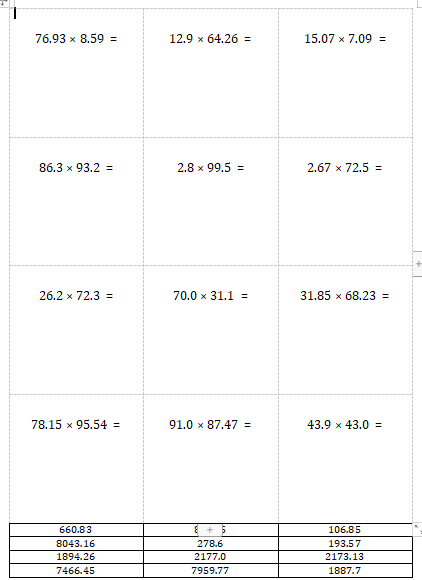

# YFedu
Automatically generate practice questions for elementary and middle school students

自动生成小学数学练习题

小数乘法练习：decimal_multiplication.py

## 安装组件

```python
pip install python-docx
```

## 结果

word页面


